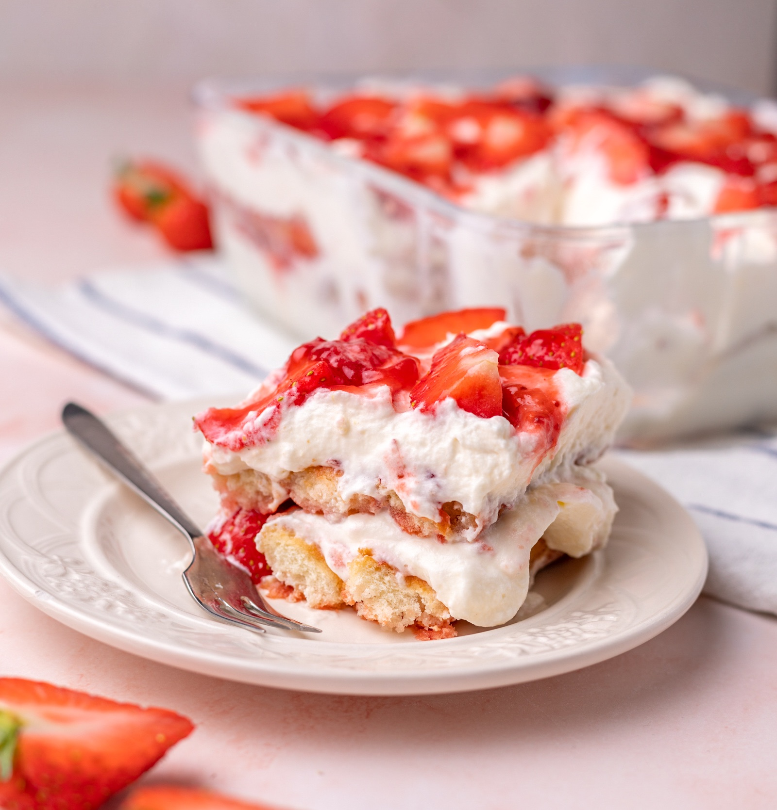

# Aardbeientiramisu

Recept voor 6 à 8 personen.

## Ingrediënten

- 500 g aardbeien
- 500 g mascarpone
- 500 ml slagroom
- 75 g fijne suiker
- 1 zakje vanillesuiker
- 2 pakken lange vingers
- 150 ml sinaasappelsap
- 1 el suiker
- eventueel 1 el Grand Marnier of amaretto
- een paar aardbeien voor de afwerking
- eventueel wat witte chocolade

## Bereiding

### 1. Maak de aardbeiensaus

Maak 250 g aardbeien schoon en snijd ze in stukjes.
Doe ze met 1 eetlepel suiker en 2 eetlepels water in een pannetje.
Laat ongeveer **5 minuten zachtjes koken** tot je een mooie saus krijgt.
Mix eventueel kort met de staafmixer.
Laat volledig afkoelen.

### 2. Maak de mascarponecrème

Klop de slagroom met de suiker en vanillesuiker stevig.
Roer de mascarpone eerst even los en spatel daarna de slagroom er voorzichtig door.

### 3. Bereid de lange vingers

Meng het sinaasappelsap eventueel met de Grand Marnier.
Doop de lange vingers **heel kort** in het sap.
Niet te lang, anders worden ze slap.

### 4. Bouw de tiramisu op

In een mooie schaal:

1. laagje lange vingers
2. helft van de aardbeiensaus
3. helft van de mascarponecrème
4. flinke laag verse aardbeien in stukjes
5. opnieuw lange vingers
6. resterende aardbeiensaus
7. resterende mascarponecrème

Strijk de bovenkant mooi glad.

### 5. Laat opstijven

Zet minstens **4 uur in de koelkast**, maar eerlijk gezegd is hij **nog lekkerder als je hem de avond ervoor maakt**.
😋

Werk vlak voor het serveren af met verse aardbeien en eventueel wat **geraspte witte chocolade**.
