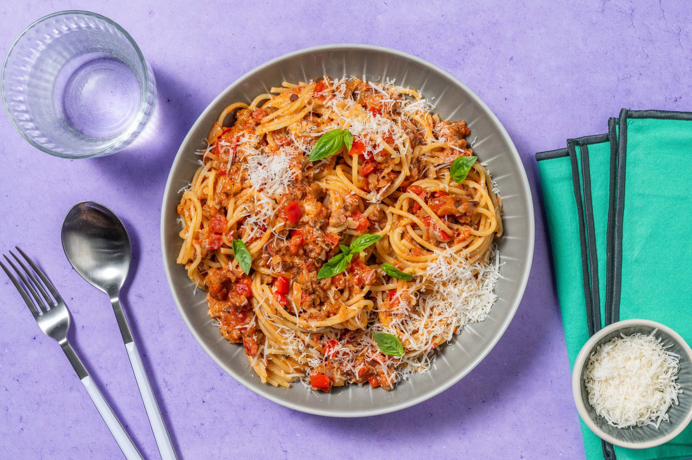

# An Miracoli

Dit eenvoudig en lekker recept hebben we van An Leyssen. Het is snel klaar en heerlijke maaltijd na een vermoeiende werkdag.

Recept voor vier personen.

## Ingrediënten

- 1 ui
- 2 paprika's (in reepjes snijden)
- 700g varken-kalfs gehakt
- 2 potten (800g) Miracoli pastasaus (Italiano)
- 500g mascarpone
- 500g Spaghetti

## Bereiding

- Bak het gehakt in een kastrol die voldoende groot is
- Doe de ui en de paprika erbij en stoof nog vijf à tien minuutjes
- Kook ondertussen de spaghetti volgens de verpakking en giet af wanneer die klaar is (laat nog even uitlekken in het vergiet en doe dan terug in de kastrol)
- Doe de miracoli saus bij het gehakt
- Doe de mascarpone er ook bij en laat nog garen tot al de mascarpone gesmolten is
- voeg nu dit alles bij de spaghetti en dien op.
