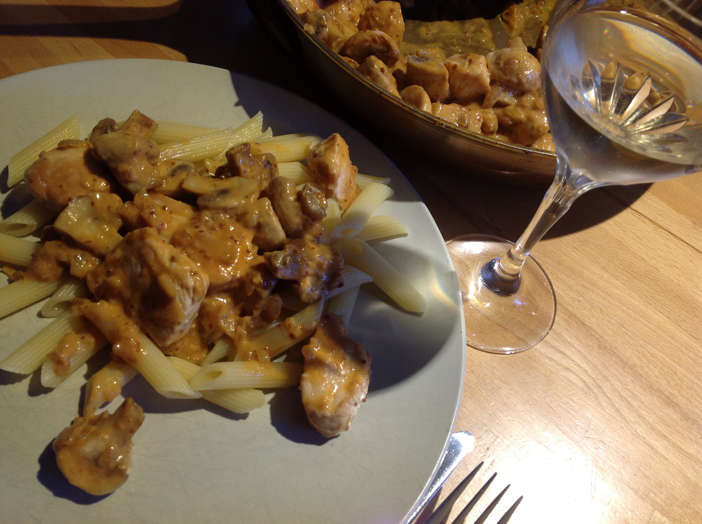

# Champignon Stroganoff

Gerecht voor 4 personen.

## Ingrediënten

- 1 grote ajuin
- 500g champignons, mogen grote zijn
- 1 theelepel tomatenpuree
- 1 theelepel moster op grootmoeders wijze (met de zaadjes)
- 150 ml room
- 1 theelepel paprikapoeder, en een beetje extra om te strooien bij het afwerken
- verse peterselie om af te werken
- Zout en peper
- 500 g  kalkoenfilet

## Bereiding

- Snijd de kalkoenfilet in hapklare blokjes
- Kuis de champignons en deel ze in vier
- Snijd de ajuin in fijne stukjes
- Verhit wat boter in een grote pan en fruit er de ajuin in
- Voeg de champignons toe en bak ze op een stevig vuurtje tot ze zacht beginnen worden
- Ondertussen bak je de kalkoenblokjes in een andere pan
- Voeg de tomatenpuree, de mosterd en de room toe
- Laat nog 5 min net niet koken en roer ondertussen zachtjes
- Voeg nu de gebakken kalkoenblokjes toe
- Voeg dan de paprikapoeder toe en kruid met peper en zout
- Opdienen met basmatirijst of Frans brood
