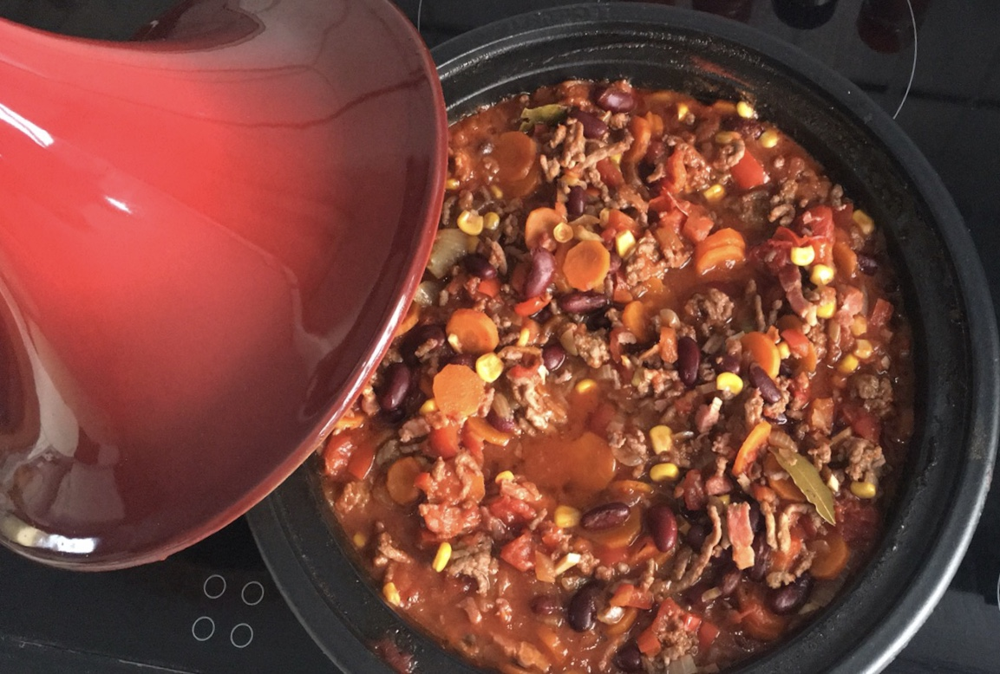

# Chili con carne

Recept voor 4 personen.

## Ingrediënten

- 2 dikke uien
- 4 teentjes look
- 2 rode paprika’s
- 1 chili pepertje
- 3 dikke wortelen
- 700g gemengd gehakt
- 200g spekblokjes
- 1 groot glas rode wijn
- Snuifje komijn
- 1 kaneelstokje
- Snuifje koriander
- Beetje gedroogde tijm
- Snuifje paprikapoeder
- 4 kleine laurierblaadjes
- Tomatenblokjes 800g
- Rode bonen 400g
- Mais 120g
- 33cl groentensap

## Bereiding

- Bak de ui samen met de look in een beetje olijf olie
- Voeg er de wortel en paprika en het chilipepertje aan toe en laat ongeveer 10 minuutjes sudderen op een zacht vuurtje
- Bak in een andere pan het gehakt rul
- Voeg er alle kruiden aan toe alsook het kaneelstokje en de laurierblaadjes
- Blus het gegaarde gehakt met de rode wijn
- Laat nog een kleine 10 minuutjes verder sudderen
- Voeg het gehakt samen met de groenten
- Voeg de tomatenblokjes toe samen met de bonen, de mais en het groentensap en de voorgegaarde spekblokjes
- Laat ongeveer 2 uur zachtjes pruttelen.
- Eventueel bijkruiden met komijn, koriander, paprikapoeder of kaneelpoeder

Opdienen met de rijst en zure room zoals in het recept hieronder beschreven staat.

Smakelijk!
