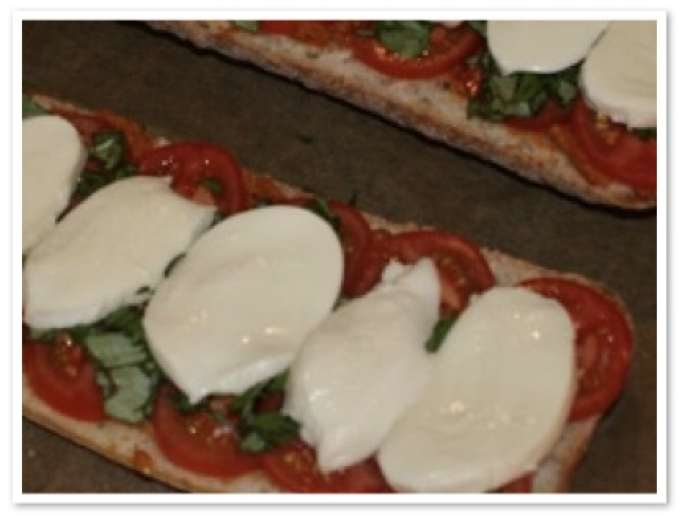

# Ciabatta met tomaat en mozzarella

Gerecht voor 2 personen.

## Ingrediënten

- 1 Ciabatta brood (je weet wel, model surfplank met veel lucht erin)
- 1 potje rode pesto
- 3 tomaten
- 2 pakjes Mozzarella (twee ja, dan heb je lekker veel en kun je precies één plakje opeten voordat alles in de oven gaat.)
- verse basilicum uit de tuin
- Bier

## Bereiding

1. Zet de oven alvast aan, snij of hak de verse basilicum zo klein mogelijk, snij de mozzarella in dunne plakjes en eet er ééntje van op en snij de tomaten in dunne plakjes.
2. Snij nu de ciabatta in de lengte door en bestrijk beide oppervlakten met een laagje verdunde rode pesto. Leg hier de plakjes tomaat op. Strooi hier de vermalen verse basilicum op en leg daarna de plakjes mozzarella hier overheen. Niet dicht klappen! Ben jij gek!?
3. In de oven ermee, drink het bier en wacht tot de Mozzarella bruin begint te worden. Haal eruit, laat een paar minuten afkoelen (want dan kun je daarna lekker dooreten) en
4. aanvallen maar!
