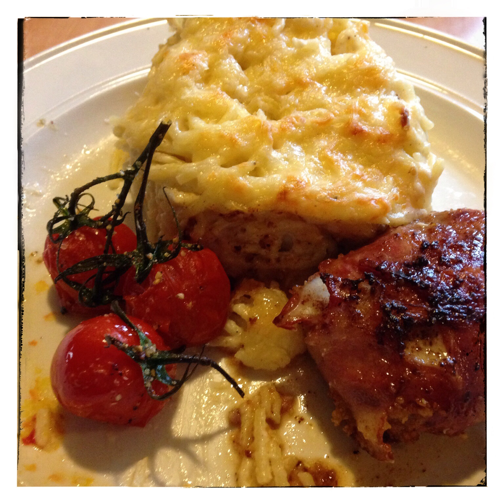

# Drie kazen pasta met tomaatjes in de oven en spekburgers

## Ingrediënten

- Spaghetti
- Boter, bloem en melk voor bechamelsaus
- Peper en zout
- 200g emmentaler geraspt
- 200g cheddar geraspt
- 200g roomkaas

## Bereiding

- Kook de pasta al dente (deze gaat dadelijk nog de oven in, dus niet te gaar koken)
- Maak bechamelsaus en voeg nadien de kazen één voor één toe als de saus van het vuur is.
- De spaghetti onder de saus doen.
- Doe alles in een vuurvaste schotel en strooi er nog een beetje kaasmengeling over om te gratineren in de oven.
- Doe de schotel in een voorverwarmde oven van 180°c voor ongeveer een half uurtje.

## De tomaatjes

### Ingrediënten

- Ongeveer een 6 tal tomaatjes per persoon (kleine trostomaatjes)
- Olijfolie
- Gedroogde look uit een molen
- Peper en zout

### Bereiding

- Was de tomaatjes en leg ze in een vuurvaste schotel.
- Besprenkel met de olijfolie.
- Kruid met peper en zout.
- Doe er royaal de gedroogde look uit de molen op.
- Zet dit geheel gedurende 20 minuutjes in de oven op 180°c (dit kan gelijktijdig met de pasta in de oven)

## De spekburgers

- Bak de burgers gaar in een pan met een beetje boter.

Dien alles samen op!

Smakelijk!
