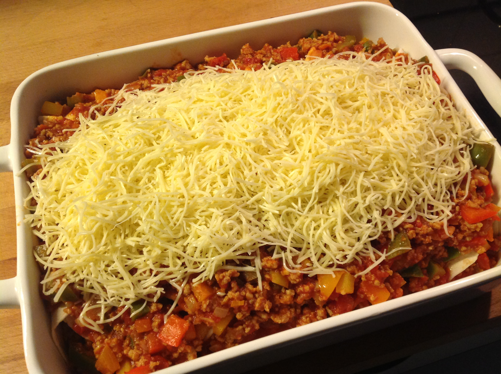

# Enchiladas met gehakt, guacamole en zure room

Gerecht voor 4 peronen.

## Ingrediënten

* 8 tortilla's
* 2 uien
* 2 teentjes look
* 500g rundergehakt
* 3 paprika's (verschillende kleuren)
* 1 doosje tomaten puree
* 800g tomaten blokjes 
* Peper en zout
* Een snuifje komijn
* Geraspte kaas
* Zure room (15%)
* Guacamole (mild)

## Bereiding

Snipper de ui en pers de look. Bak dit glazig in olijfolie. Voeg hierna het rundergehakt toe en bak dit rul. Voeg de tomatenpuree toe en bak even mee.

Snij de paprika in blokjes en voeg samen met de tomatenblokjes aan het gehakt toe en laat samen gaar sudderen op een zacht vuurtje gedurende 15 minuutjes. Kruid met peper, zout en komijn.

Verwarm de oven op 180°C en vet een ovenschaal in met wat boter.

Verdeel wat tomatensaus op het midden van de tortilla en rol op. Doe dit ook met de andere tortilla's. Leg deze rollen allemaal in de ovenschotel. Verdeel de overige saus over de tortilla's en strooi rijkelijk kaas over de enchilades.

Verwarm de enchiladas gedurende 15 minuutjes in de oven op 180°C.
