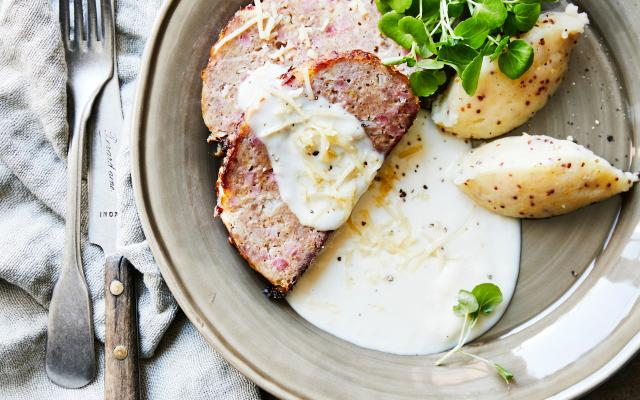

# Gehaktbrood met ham, kaas en mosterdpuree

Gerecht voor 4 personen.

## Ingrediënten

- Voor het gehaktbrood
    - 600g kalfsgehakt
    - 80g ham (in blokjes)
    - 80g gemalen gruyère
    - 1 ei
    - 50g paneermeel
    - peper en zout
- Voor de mosterdpuree
    - 800g aardappelpuree (zachtkokende)
    - 1 el graanmosterd
    - 100ml melk
    - 25g boter
- Voor de kaassaus
    - 3 el bloem
    - 2 el boter
    - 100g gemalen gruyère
    - 100g mozzarella (gemalen)
    - 500ml melk
    - nootmuskaat
    - peper en zout

- Extra
    - 1 bosje waterkers

Ilse D'hooge: “De kaas zit als verrassing niet alleen in de saus, maar ook in het gehaktbroodje”

## Bereiding

1. Verwarm de oven voor op 180°C. Meng het gehakt met de hamblokjes, de geraspte kaas, het ei en het paneermeel. Kruid nog met peper en zout en vorm met natte handen tot een bol.
2. Leg het gehaktbrood daarna op een met bakpapier beklede ovenplaat. Sprenkel er nog wat water over en zet 40 à 45 minuten in de voorverwarmde oven.
3. Kook de aardappelen gaar in gezouten water. Giet ze af en stamp met een pureestamper. Voeg eerst de boter toe, dan de melk en dan de graanmosterd. Roer tot een gladde puree.
4. Maak de kaassaus. Smelt de boter en roer er de bloem door tot een roux. Roer er dan geleidelijk de melk door tot de saus mooi ingedikt is. Voeg van het vuur de geraspte kazen toe en roer glad. Breng op smaak met peper, zout en nootmuskaat.
5. Laat het gehaktbrood even rusten onder aluminiumfolie en snij dan in plakken, serveer met de mosterdpuree, de kaassaus en wat waterkers.