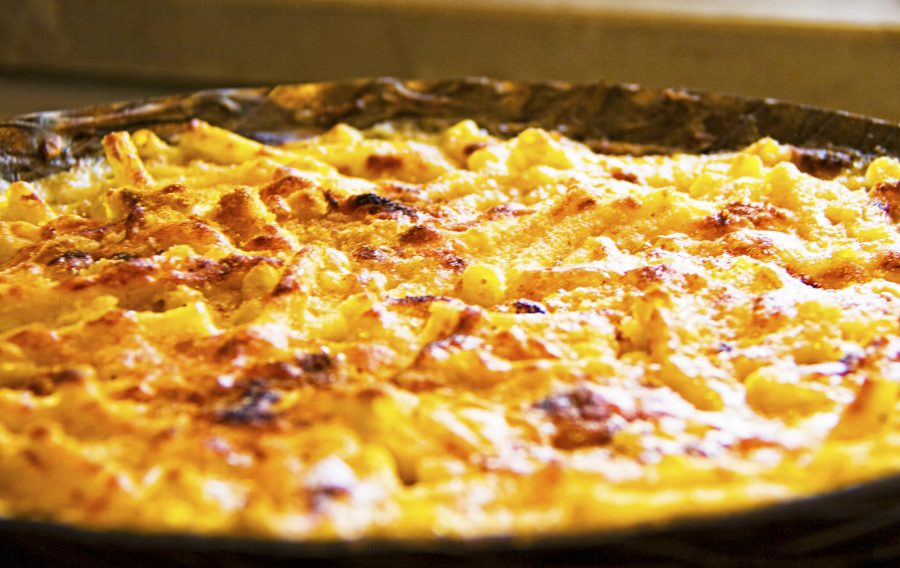

# Macaroni

## Ingrediënten

- 500g macaroni
- boter, bloem en melk
- 500g hespenblokjes (gekookte hesp)
- 250g gemalen emmentaler

## Bereiding

- Maak een bechamelsaus met de boter, bloem en melk
- Kook ondertussen de pasta in een kastrol met veel water
- Voeg de hespenblokjes toe aan de saus
- Voeg dan de emmentaler toe en laat die volledig smelten
- Doe er tenslotte de pasta bij en giet alles in een overschotel
- Strooi nog wat van de gemalen kaas over het geheel en zet in een voorverwarmde oven op 180ºC tot de kaas mooi goudbruin is.

Dien eventueel op met voor iedereen nog een gekookt eitje.
