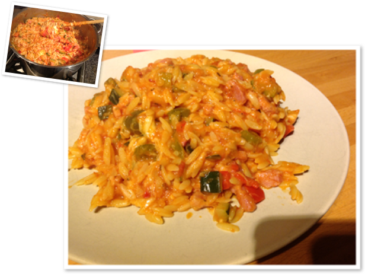

# Pasta Maya

Gerecht voor 4 personen.

## Ingrediënten (4 personen)

- 500 gr Griekse pasta
- 2 courgetten
- 3 paprika’s (1 rode, 1 gele en 1 groene)
- 1 pot Scala of Bertolli primavera saus
- 1 pot Scala of Bertolli Arrabbiata saus
- 400 gr spekblokjes
- Mozzarella

## Bereiding

1. Pasta 6 min koken in veel water.
2. De courgetten en de paprika’s in fijne blokjes snijden en stoven met een beetje boter.
3. De spekblokjes bakken en het overtollige vet nadien verwijderen.
4. De spekblokjes bij de groenten doen en ook de scala saus toevoegen, alles opwarmen.
5. Pasta en de saus samendoen, de mozzarella in kleine blokjes snijden en onder de pasta mengen.

Smakelijk!