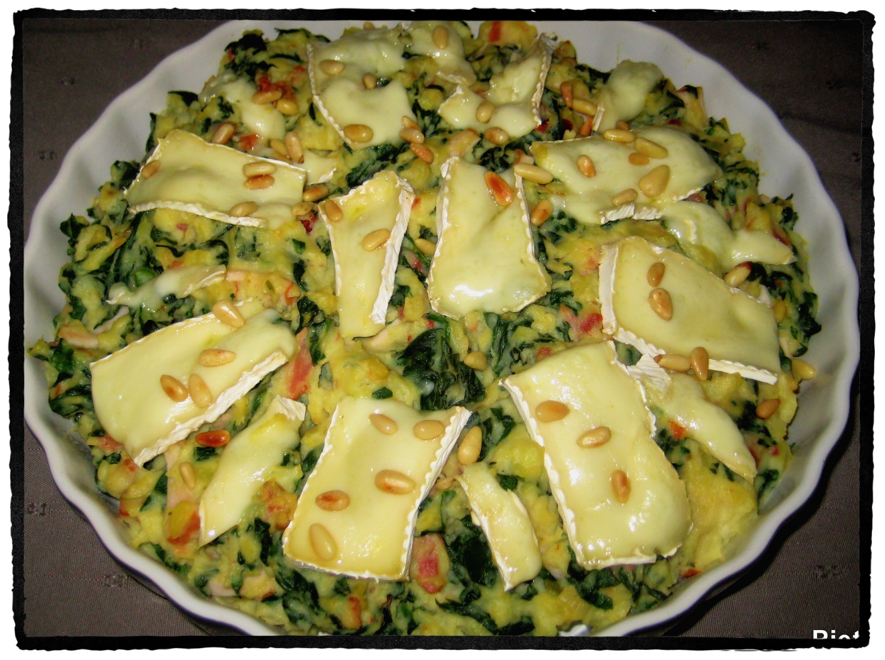

# Piëta

## Ingrediënten

- 1 kg kruimige aardappelen, geschild en in stukken
- 1 groentebouillontablet
- 2 teentjes knoflook, fijngehakt
- 3 bosuitjes, in kleine ringetjes
- 8-16 zongedroogde tomaatjes, in stukjes (afhankelijk van de grootte)
- olijfolie van de zongedroogde tomaatjes
- 450 gram verse spinazie, zonder harde steeltjes
- 2 eetlepels pijnboompitten
- 100 gram gerookte spekreepjes
- 200 gram gebakken kipfilet, in reepjes
- 100 ml crème fraîche
- zout
- versgemalen peper
- 150 gram brie, in dunne reepjes

Dit gerecht is nog lekkerder als het een tijdje op voorhand gemaakt is zodat de smaken kunnen intrekken.

## Bereiding

- Kook de aardappelen in een pan met ruim kokend water, met daarin de bouillontablet in ca. 20-25 minuten gaar.
- Rooster ondertussen de pijnboompitjes in een droge koekenpan, haal ze uit de pan en laat ze afkoelen.
- Was en droog de spinazie.
- Verhit 2 eetlepels olie uit de pot met de zongedroogde tomaatjes in een koekenpan en bak hierin de kippenblokjes, de bosuitjes, de gehakte knoflook en de stukjes zongedroogde tomaatjes ca. 2 minuten op laag vuur.
- Voeg de spinazie toe en laat de groenten op hoog vuur al omscheppend slinken.
- Neem zodra de spinazie geslonken is de pan van het vuur.
- Verwarm de grill van de oven voor op de middelste stand.
- Bak in een koekenpan de spekreepjes krokant. Bak ook de kippenblokjes.
- Giet de aardappelen af en stamp ze grof met een pureestamper.
- Voeg nu de crème fraîche, de spinazie, de kipreepjes, de helft van de pijnboompitjes en de spekreepjes.
- Roer goed door elkaar en breng op smaak met zout en versgemalen peper.
- Schep de stamppot over in een ovenschaal.
- Beleg de stamppot met dungesneden reepjes brie.
- Schuif de ovenschaal in de oven onder de grill en laat de brie ietsje smelten.
- Garneer de stamppot als laatste met de achtergehouden pijnboompitjes.
