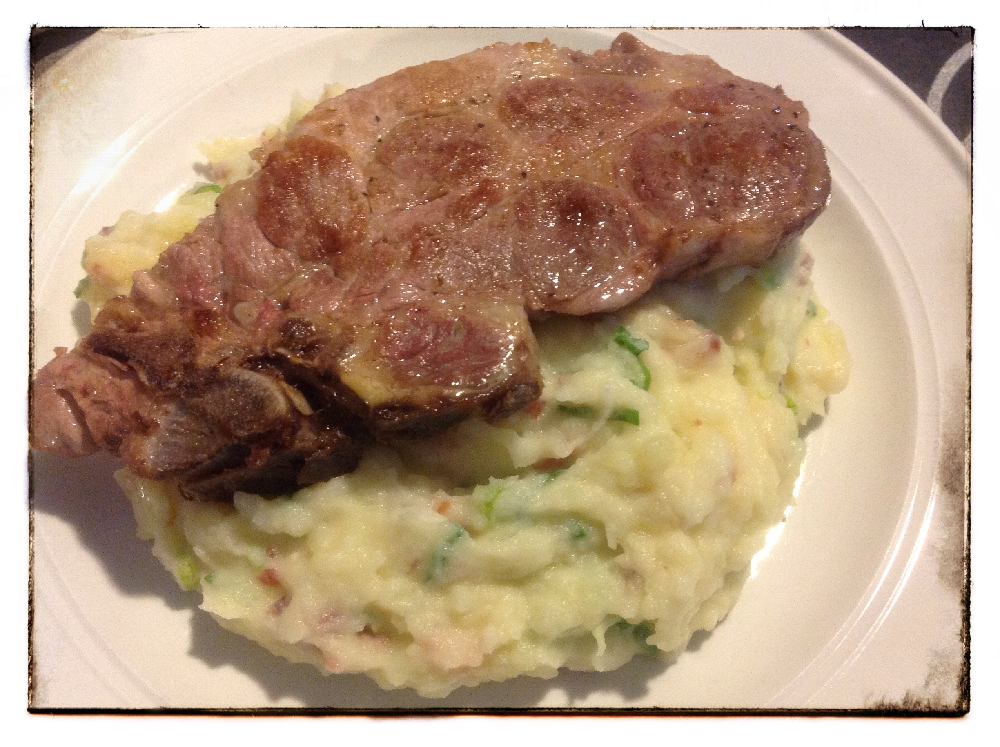

# Reblochon puree met kotelet

Recept voor 4 personen.

## Ingrediënten

- 8 patatten (voor 4 personen)
- 4 koteletten
- 3dl melk
- 350g reblochon (kan ook met brie of vieux pané, ...)
- 200g gerookte spekblokjes
- 1 teentje look
- Gehakte peterselie (ook lekker met lente uitjes)
- Lookolie
- Olie

## Bereiding

- Schil de aardappelen en kook ze gaar samen met het teentje look. Maak er puree van.
- Bak de koteletten in de olie.
- Breng de melk aan de kook, haal van het vuur. Snij de reblochon (ook de korst) in stukken en laat deze smelten in de melk.
- Bak de spekblokjes gaar in de lookolie.
- Voeg de melk, de spekblokjes en de gehakte peterselie toe aan de puree, eventueel wat bijkruiden met peper en zout.
