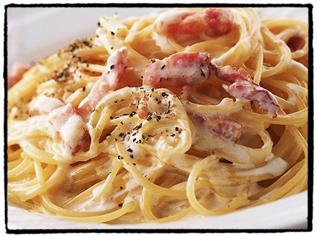

# Spaghetti Carbonara

## Ingrediënten

* 1 ui
* 4 teentjes look
* spekblokjes
* 4 eieren
* 25cl room
* Blok Parmigiana of Grana Padano
* 500g spaghetti
* olijfolie

## Bereiding

* Kook de pasta gaar 
* Bak de spekblokjes in de microgolfoven ongeveer 5 minuten
* Bak in een geut olijfolie de fijngesneden ui en look
* Giet er de room over en breng aan de kook
* Meng in een kom de eieren met de gemalen kaas
* Neem de kokende room van het vuur en voeg er een runderbouillon blokje bij
* Doe dit mengsel samen met de spekblokjes bij de 'niet meer kokende' room
* Giet de pasta af
* Meng dit alles onder elkaar

Smakelijk!
