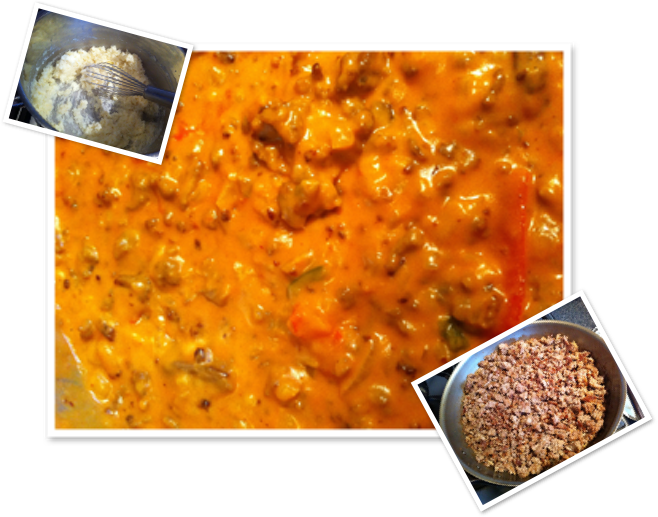

# Spaghetti à la Moeke

## Ingrediënten (4 personen)

* 1 dikke ajuin
* 1 teentje look
* 4 lepels bloem
* 1l lauwe melk
* 1 doosje tomatenpuree
* 1 flinke geut ketchup
* peper, Engelse saus
* 500 g gemengd gehakt
* 2 paprika’s
* vers gemalen emmentaler of gruyère
* Cappelini of spaghetti

## Bereiding

* Bak het gehakt in een grote pan. Af en toe omroeren en fijn maken tot het korrelig en goed bruin aangebakken is.
* Ondertussen snijd je de paprika’s in niet te lange, dunne reepjes.
* Snij de ajuin en ook de look fijn
* Stoof de paprika’s in olie op een niet te hoog vuur, voeg een beetje water toe als het te droog wordt en aanbakt.
* Maak een béchamel met ajuin: stoof de ajuin met de look lichtjes bruin (blonderen in boter), voeg de zes vorken bloem toe en roer, voeg dan langzaam op een hoog vuur melk toe, niet teveel ineens en zeker geen koude melk gebruiken. Meng de bloem goed met de melk alvorens een nieuwe geut melk langzaam toe te voegen. Doe dit tot je een smeuïge béchamelsaus krijgt. Laat het goed doorkoken om de smaak van de bloem te neutraliseren. Ondertussen blijf je steeds goed roeren.
* Voeg dan de tomatenpuree toe, een beetje ketchup, peper en Engelse saus.
* Nogmaals goed doorroeren en dan de gestoofde paprika’s en het gehakt toevoegen.
* Haal de pan van het vuur en kook de spaghetti (wij hebben met vier personen zo’n 750 gr spaghetti nodig, als we grote honger hebben).
* Serveer met de gemalen kaas.

## Met de overschot
Als er wat over is kan je best saus en spaghetti samen in een kookpot doen en de volgende dag opwarmen. Voeg daarvoor opnieuw wat melk aan het geheel toe tijdens het opwarmen.
Als het teveel is of je wilt het bewaren voor later kan je het perfect invriezen.
