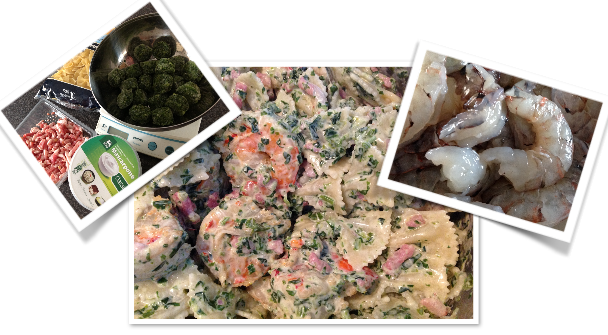

# Pasta met spinazie en scampi -- strikjes

## Ingrediënten

- 500 gr farfale pasta
- 400 gr gehakte spinazie (zonder room)
- 400 gr spekblokjes
- 20 scampi’s
- 500 gr mascarpone

## Bereiding

- Kook de pasta in veel water
- Bak de spekblokjes, verwijder het overtollige vet en zet ze weg
- Bak de scampi’s in dezelfde pan
- De spinazie opwarmen en eventueel nog wat fijner mixen
- Meng de mascarpone onder de spinazie
- Voeg nadien de spekblokjes en de scampi’s toe
- Alles onder de pasta mengen
