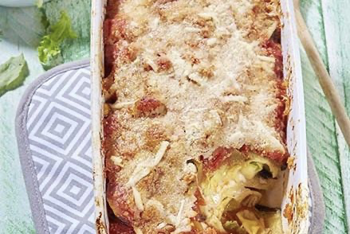

# Gegratineerde tortellini met aubergine en Italiaanse kazen

### Ingrediënten

- 2 aubergines
- 1 rood pepertje
- 1 sjalot
- 150 g provolone (harde kaas)
- 50 g pecorino (blok)
- 500 g tortellini met ricotta en spinazie (versmarkt)
- 400 g tomatenstukjes (blik)
- 375 g ratatouille (blik)
- 3.5 eetl. olijfolie
- peper en zout

### Voorbereiding

(40 min.)

- Verwijder de pitjes en de witte zaadlijsten uit het rode pepertje en snipper fijn.
- Snij de aubergine in plakken van 1 cm. Bestrooi ze met zout en laat 30 min. uitlekken in een vergiet. Leg er eventueel een gewicht op, dan gaat het vocht er nog beter uit. Spoel het zout eraf en dep droog.
- Verwijder intussen de korst van de provolone en snij in plakjes.
- Rasp de pecorino.
- Snipper de sjalot fijn.
- Verwarm de oven voor op 200 °C.

### Bereiding

Leg de aubergineplakken op een bakplaat met bakpapier. Besprenkel met 2 eetl. olijfolie en bak 15 min. in de voorverwarmde oven. Draai na 8 min. om. Haal uit de oven.

Kook de pasta beetgaar in lichtgezouten water (kooktijd: zie verpakking). Giet af en laat uitlekken.

Verhit intussen 1 eetl. olijfolie in een kookpot en stoof de sjalot glazig. Voeg het rode pepertje toe en laat nog 1 min. stoven. Voeg de tomatenblokjes en de ratatouille toe en kruid met peper en zout. Laat 10 min. sudderen.

Bestrijk een ovenschaal met 1/2 eetl. olijfolie. Leg er een laag aubergineplakken in. Bedek met de helft van de pasta en de helft van de provolone. Herhaal en eindig met een laag aubergine. Overgiet met de saus.

Bestrooi met de pecorino en zet 15 à 20 min. in de voorverwarmde oven. Haal uit de oven en laat 10 min. rusten.
