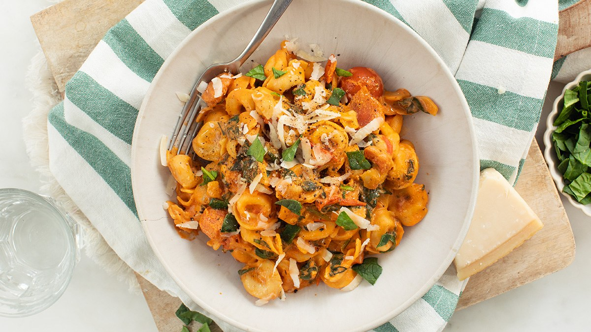

# Tortellini met een romige tomatensaus

Recept voor vier personen.

## Ingrediënten

- 400 gr tortellini (vulling naar keuze)
- 2 uien
- 4 tenen knoflook
- 500 gr cherry tomaatjes
- 8 geroosterde paprikas (in reepjes snijden)
- 2 eetlepels tomatenpuree
- 300 ml room
- 100 gr Parmezaanse kaas
- 200 gr verse spinazie
- zout & peper
- Italiaanse kruiden
- Optioneel: red chili flakes, pijnboompitten

## Bereiding

- Hak de ui en knoflook fijn. Verhit een beetje olie of boter in een pan en fruit de ui en knoflook hierin.
- Voeg de tomatenpuree toe en bak een minuutje mee.
- Doe dan de geroosterde paprika in reepjes erbij, net als de Italiaanse kruiden, peper, zout en de hele cherrytomaatjes (deze kun je evt. ook doormidden snijden).
- Doe dan de verse grof gehakte spinazie erbij en schep erdoor tot het warm is.
- Bak nog een paar minuutjes tot de tomaatjes zacht zijn.

- Kook ondertussen de tortellini beetgaar volgens de verpakking.

- Giet de room bij de groenten en roer er goed doorheen.
- Voeg vervolgens ook de geraspte Parmezaanse kaas toe.

- Dan is de romige tomatensaus klaar en kan de gekookte tortellini erbij.
- Schep dit door de saus en laat heel eventjes zachtjes mee pruttelen.

Serveer de tortellini eventueel met wat extra Parmezaanse kaas.

Lekker met nog wat pijnboompitjes.
