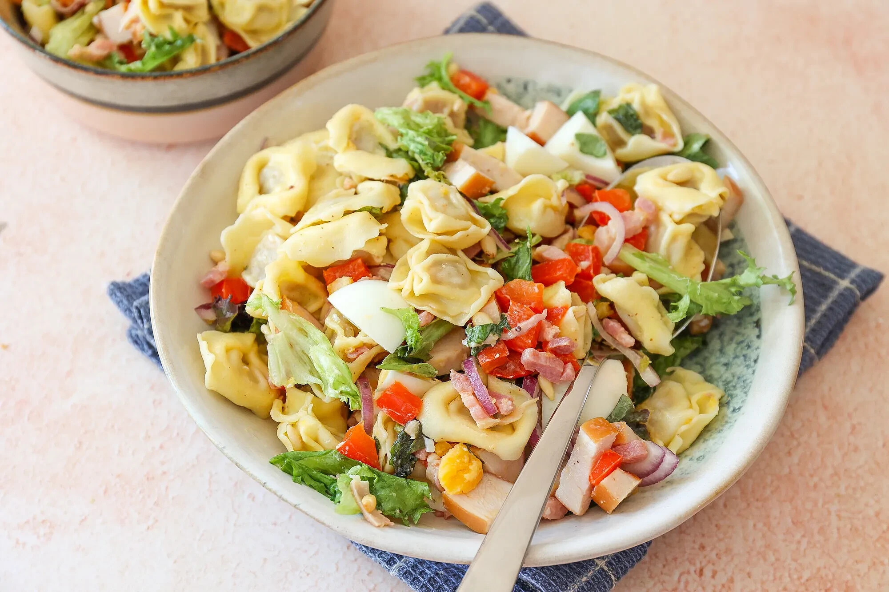

# Tortellini Salade met Kip en Spekjes

Een lekkere pastasalade met tortellini, sla, kip, spekjes en ei. Deze salade kun je als hoofdgerecht serveren met bijvoorbeeld een stokbroodje erbij maar wij hebben ‘m laatst ook bij een barbecue geserveerd.

Bereidingstijd: 20 min

Recept voor: 6 personen

## Ingrediënten

- 500 gr tortellini bijv met kaas
- 300 gr gerookte kip circa
- 200 gr spekjes
- 4 eieren
- 6 el honing-mosterd dressing
- 100 gr rucola melange
- 2 rode ui
- 2 paprika
- 4 el pijnboompitten
- snufje zout en peper

## Bereiding

- Kook de pasta volgens de instructies op de verpakking.
- Kook de eieren in ongeveer 8-9 minuten hard.
  Laat de eieren schrikken en snijd ze in stukjes/partjes.
- Snijd de paprika in blokjes en de rode ui in dunne, halve ringen.
  Snijd ook de gerookte kip in blokjes.
- Bak de spekjes, zonder olie, in een pan totdat ze bruin en krokant zijn.
  Wij bakken zelf de paprika ook even mee.
- Eventueel kun je de pijnboompitten ook even roosteren in een pan totdat ze goudbruin zijn.
- Meng in een grote kom de tortellini, honing mosterd dressing, paprika, pijnboompitten, spekjes, rucola melange, gerookte kip en pijnboompitten.
  Serveer direct.

## Tip

Als je de salade later wilt serveren, voeg dan nog niet de rucola melange toe.
Doe dit pas op het laatste moment.

Bron: https://www.lekkerensimpel.com/tortellini-salade-met-kip-en-spekjes/
