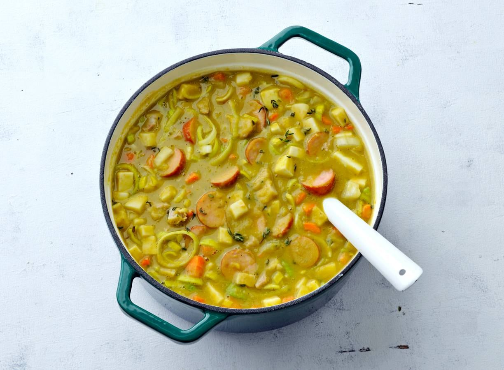

# Erwtensoep

Een traditionele Nederlandse erwtensoep.
Dit recept is voor 4 personen.

## Ingrediënten

- 500 g spliterwten
- 1 rookworst
- 200 g doorregen spek
- 2 preien, in ringen
- 2 uien, gesnipperd
- 3 winterwortelen, in blokjes
- 2 stengels bleekselderij, in stukjes
- 2 liter water of bouillon
- Zout en peper naar smaak

## Bereiding

1. Was de spliterwten en doe ze samen met het spek in een grote pan.
2. Voeg het water of de bouillon toe en breng aan de kook.
3. Laat de soep 1,5 uur zachtjes koken tot de erwten zacht zijn.
4. Voeg de ui, prei, wortel en bleekselderij toe.
5. Voeg de rookworst toe en laat alles nog 30 minuten meekoken.
6. Haal de rookworst en het spek uit de pan, snijd in stukjes en doe terug in de soep.
7. Breng op smaak met zout en peper.

## Tip

Erwtensoep smaakt de volgende dag nog beter.
Bewaar de soep in de koelkast en warm hem rustig op.
