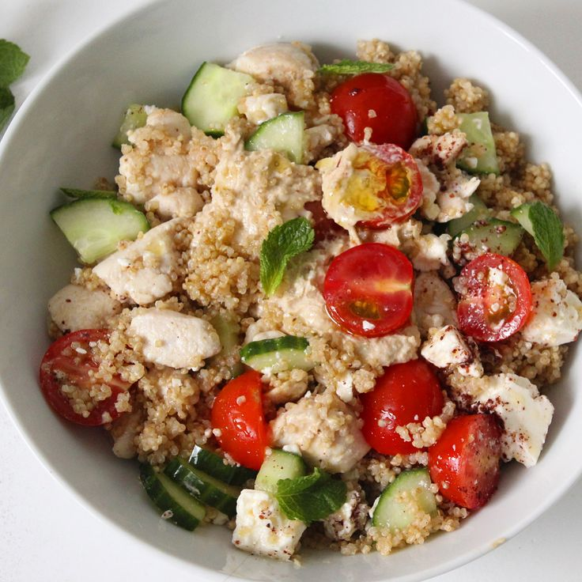

# Mediterrane quinoasalade met gegrilde kip

Fris, voedzaam en perfect voor een hete dag — koud of op kamertemperatuur te serveren, en makkelijk vooraf te bereiden.

## Ingrediënten

- 300 grams quinoa
- 600 milliliters water of bouillon (voor de quinoa)
- 600 grams kipfilets
- 5 tablespoons olijfolie
- 2 citroenen, sap en rasp
- 2 komkommer
- 400 grams cherrytomaatjes, gehalveerd
- 200 grams feta, verkruimeld
- 1 rode ui, fijngesnipperd
- 0.3 cups verse muntblaadjes, gehakt
- 0.5 cups platte peterselie, gehakt
- 2 knoflookteentjes, geperst
- 1 teaspoons zout
- 0.5 teaspoons zwarte peper

## Bereiding

1. Quinoa koken: Spoel 300 grams quinoa even af onder koud water. Breng 600 milliliters water of bouillon (voor de quinoa) aan de kook, voeg de quinoa toe, dek af en laat zachtjes garen.
2. Quinoa laten afkoelen: Haal van het vuur, laat 5 minuten rusten met deksel erop, roer los met een vork en laat volledig afkoelen (kan buiten in de schaduw of even in de koelkast).
3. Kip kruiden en grillen: Bestrijk 600 grams kipfilets met 2 el van de 5 tablespoons olijfolie, 1 teaspoons zout en 0.5 teaspoons zwarte peper. Gril of bak de kip op middelhoog vuur tot ze gaar is en een mooi korstje heeft.
4. Kip laten rusten en snijden: Laat de kip 5 minuten rusten voor je ze in blokjes of reepjes snijdt — zo blijft ze sappig.
5. Groenten voorbereiden: Snijd 2 komkommer in blokjes, halveer de 400 grams cherrytomaatjes, gehalveerd, en snipper de 1 rode ui, fijngesnipperd fijn.
6. Dressing maken: Klop de rest van de 5 tablespoons olijfolie los met het sap en de rasp van 2 citroenen, sap en rasp en de 2 knoflookteentjes, geperst.
7. Alles mengen: Meng de afgekoelde quinoa met de groenten, kip, 0.3 cups verse muntblaadjes, gehakt, 0.5 cups platte peterselie, gehakt en de dressing. Breng op smaak met extra zout en peper.
8. Feta toevoegen en serveren: Werk af met de verkruimelde 200 grams feta, verkruimeld. Serveer meteen op kamertemperatuur, of zet nog even in de koelkast voor extra frisheid.

## Tip

Tip voor warme dagen: maak dit gerust een paar uur op voorhand — de smaken trekken er alleen maar beter in. Geen zin om te grillen? Gerookte kip of gegrilde garnalen werken ook prima, of laat de kip weg voor een vegetarische versie met extra feta en olijven. Lekker met wat vers stokbrood of gewoon puur als lichte maaltijd.